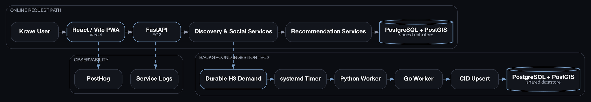
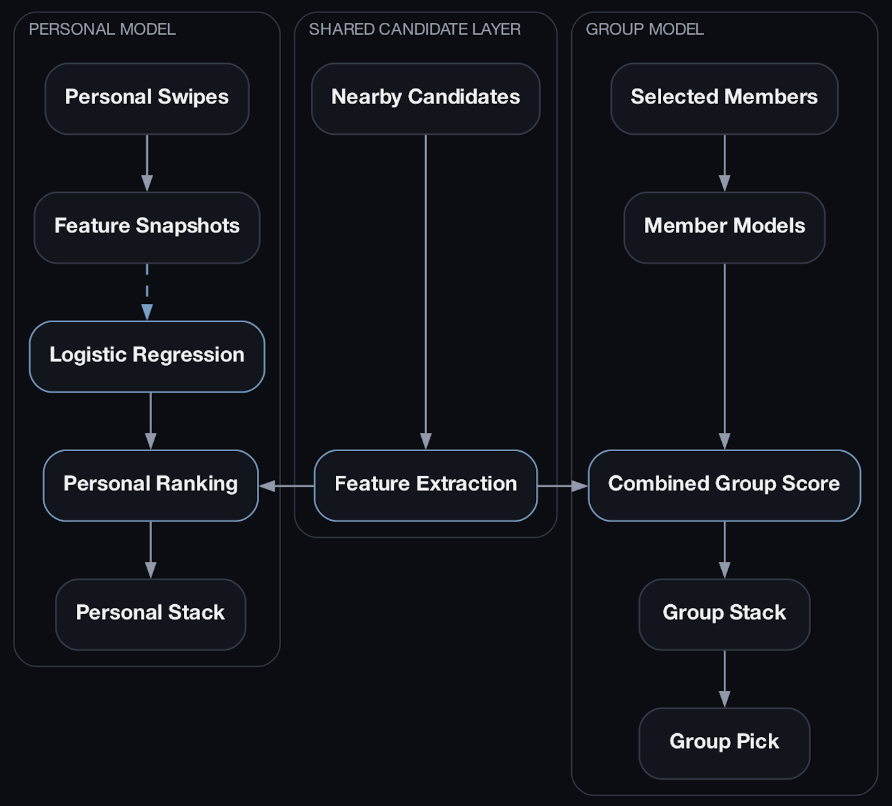
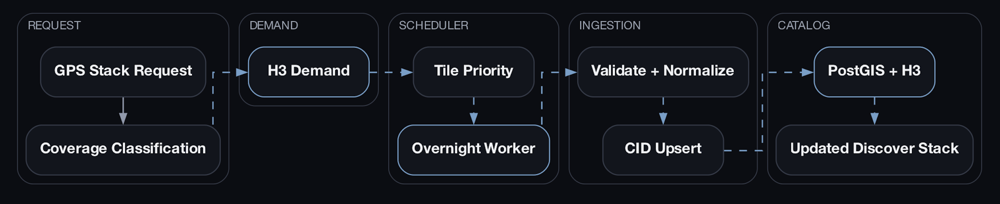

# Krave

**Swipe-driven restaurant discovery powered by geospatial search, personalized ranking, and demand-driven catalog growth.**

[Live app](https://www.kravematch.com) · [Engineering blog](https://www.wmcvicar.me/blog/)

Krave helps people discover nearby restaurants through a swipe-based interface. Personal recommendations adapt to each user's behavior, while Group Discovery combines the learned preferences of selected friends without changing anyone's personal model.

The platform also expands geographically from real product demand: when someone opens Krave in an uncovered area, the backend records durable H3 demand and queues that region for overnight ingestion.

---

## What Krave does

- Ranks nearby restaurants from live GPS and user-defined search radius
- Learns personal taste with per-user logistic regression
- Supports independent Personal and Group Discovery flows
- Creates Taste Matches and Group Picks from recommendation scores
- Stores and queries restaurants with PostgreSQL, PostGIS, and H3
- Expands coverage from distinct-user geographic demand
- Runs asynchronous overnight ingestion with leasing, retries, and CID upserts
- Measures product behavior and performance through privacy-conscious PostHog analytics

---

## Architecture

### Krave system architecture

The online request path serves discovery, social features, and recommendation scoring. Catalog expansion runs asynchronously on EC2 and writes into the same PostgreSQL/PostGIS datastore.



### Personal + group recommendation architecture

Personal and Group Discovery share the same nearby candidate layer while keeping their interaction state separate. Group swipes do not retrain personal models or consume the personal swipe queue.



### Demand-driven restaurant ingestion

A stack request can record durable H3 demand without waiting for ingestion. Prioritized regions are processed later by the overnight worker and become available in future Discover stacks.



---

## Recommendation system

### Personal Discovery

Each swipe stores the feature snapshot used at prediction time. Once the account has enough balanced swipe history, Krave trains a per-user L2 logistic-regression model and periodically retrains it from recent interactions.

The model produces a predicted preference probability for each nearby candidate. That score is used to rank the Personal Discover stack and determine qualified Taste Matches.

### Group Discovery

Group Discovery combines the existing taste models of selected friends against the same nearby candidate set.

Group interactions remain isolated from Personal Discovery:

- group swipes do not retrain personal models
- group swipes do not remove restaurants from personal queues
- group state is stored independently
- combined scoring rewards broad agreement while still considering each member's minimum score

---

## Demand-driven coverage

When the nearby catalog has no restaurants, Krave distinguishes that state from:

- a user having already seen all eligible restaurants
- restrictive filters removing every candidate
- a sparse area with fewer restaurants than the requested stack size

For truly uncovered areas, the API records demand across nearby H3 cells. Distinct users contribute more priority than repeated refreshes from one account.

The overnight worker then:

1. selects the next eligible tile by priority
2. leases one tile using database locking
3. runs the ingestion worker
4. validates and normalizes incoming records
5. performs stable CID-based insert-or-update logic
6. assigns PostGIS geography and H3 indexing
7. releases the lease and records the result

New work may start from **2:00 AM inclusive to 7:00 AM exclusive** in `America/Toronto`. A job that begins before the cutoff may finish afterward, but no new tile starts once the window closes.

---

## Tech stack

| Layer | Technologies |
|---|---|
| Frontend | React, TypeScript, Vite |
| Backend | Python, FastAPI |
| Ingestion | Go, Python orchestration |
| Database | PostgreSQL, PostGIS |
| Spatial indexing | H3 |
| Recommendations | Logistic Regression |
| Analytics | PostHog |
| Deployment | Vercel, AWS EC2, systemd |

---

## Repository structure

```text
.
├── frontend/                  React + TypeScript client
├── backend/                   FastAPI API, services, models, and migrations
├── scraper-go/                Go ingestion worker
├── deploy/systemd/            EC2 service and timer definitions
├── scripts/                   Deployment and local tooling
└── docs/architecture/         README architecture diagrams
```

---

## Local development

### Prerequisites

- Node.js and npm
- Python 3
- Go
- PostgreSQL with PostGIS
- Google OAuth credentials

### Frontend

```bash
cd frontend
npm install
npm run dev
```

### Backend

```bash
cd backend
python -m venv .venv
source .venv/bin/activate
pip install -r requirements.txt
alembic upgrade head
uvicorn app.main:app --reload
```

### Go worker

```bash
cd scraper-go
go mod download
go test ./...
```

The worker should not be run against production resources from a local environment unless that is explicitly intended and configured safely.

---

## Environment configuration

The project uses environment variables for database access, authentication, analytics, CORS, and deployment-specific behavior.

Common frontend variables include:

```env
VITE_API_BASE=
VITE_POSTHOG_KEY=
VITE_POSTHOG_HOST=
```

Common backend variables include:

```env
DATABASE_URL=
CORS_ALLOWED_ORIGINS=
CRAVE_AUTONOMOUS_SCHEDULER=false
```

Do not commit production credentials. Use the repository's example environment files as the source of truth for the current configuration.

---

## Production deployment

- **Frontend:** Vercel
- **API:** FastAPI on AWS EC2
- **Background ingestion:** Python and Go workers on AWS EC2
- **Scheduling:** systemd timer
- **Database:** PostgreSQL with PostGIS

The production timer owns overnight ingestion. The FastAPI process does not start a second in-process scraper scheduler.

---

## Testing

```bash
# Frontend
cd frontend
npm test
npm run lint
npm run build

# Backend
cd backend
pytest

# Go
cd scraper-go
go test ./...
```

---

## Privacy

Krave's analytics integration is designed to avoid sending exact user coordinates, H3 identifiers, authentication tokens, or raw private data to PostHog.

Location demand is aggregated for coverage planning, and architecture diagrams intentionally omit production secrets, internal addresses, and user identifiers.

---

## Status

Krave is under active development. Current work focuses on:

- improving recommendation quality
- expanding geographic coverage
- reducing page and stack latency
- refining Group Discovery
- strengthening ingestion reliability and observability
